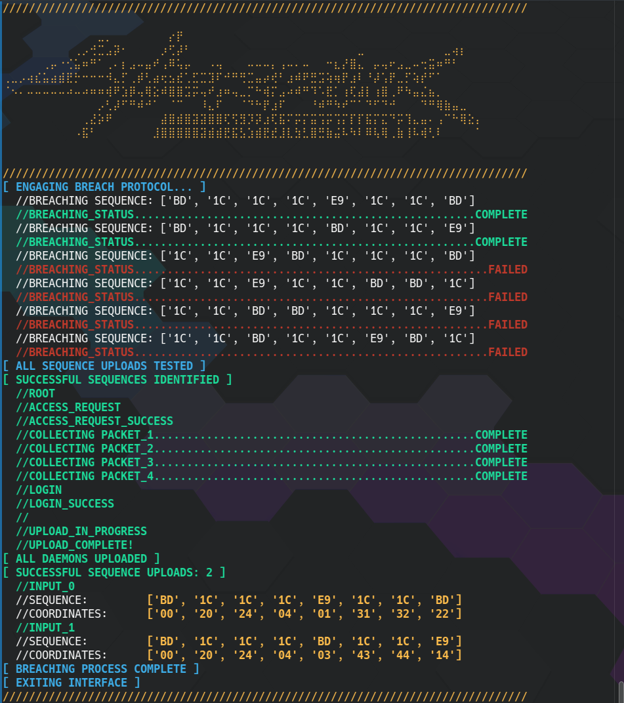

# Cyberpunk 2077: Automatic Protocol Breacher




## How's it goin, Chooms?

As someone who loves Cyberpunk 2077 and Netrunning, this is just a fun project for one of my favorite games. Also beware of the incoming Cyberpunk slang. 

It is still in it's early stages, but this script works enough to provide all solutions uploading the most (or at least best) hexcode seauences to any access point breach problem you will find in the game. As of now, it uses heuristics and recursiion to traverse the matrix, applying the game's logic for terminating nonviable paths. 

In the future, it will have two algorithm options: finding all possible solutions and finding the shortest possible solution that uploads the best hexcode sequencs with the minimal amount of buffer used. The latter will hopefully apply heuristcs more cleverly. I am still developing a way to handle branching path solutions for the comprehensive solution finder in addition to an image processing and image text recognition pipeline so eventually, the input will just be a picture of the access point. 

I also added some unncessary ascii art, neon colors, and messages found on access points in game to make it more fun. 

This is a command line tool built in linux that uses python3, conda, and some fun dependencies (for image processing later). I assume it will work on windows, but I have not tested it so your mileage may vary. 

There is no GUI. A real Netrunner would use the terminal, anyway, right? It would be clever to add this as a mod in the game and add a keybinding to it, but alas, I am no game modder. 

Enjoy! Now go make some eddies.


## Installation

First things first, install git and conda. For information on how to do that, start here: [Install Conda](https://conda.io/projects/conda/en/latest/user-guide/install/index.html)

This utilizes a conda environment to manage the packages. I found this to be the easist deployment method, but install may take awhile.

Here are the install commands

```
git clone https://github.com/bnjenner/Cyberpunk_2077_Breach_Protocol.git
cd Cyberpunk_2077_Breach_Protocol.git
conda env create -f environment.yml
conda activate breach_protocol
```

Now, make the script executable. The command below is for linux. I imagine it is not hard to do something similar on windows.

```
chmod +x breach_protocol.py
```

Preem, time to get cracking, just don't go poking the wrong bears. Don't wanna get zeroed by Netwatch.


## Usage

I am still working out how to specify inputs for this tool whle I work on image processing. So unfortunately, you will have to manually edit breach_protocol.py. The frames and sequences are formatted as a list of lists. The positions of each item should be identical to how it is seen in the game.
To input your data, modify the following variables:
* FRAME: the matrix you are trying to crack
* SEQUENCES: the sequences you are trying to upload
* BUFFER_SIZE: your buffer size

I have also considered a json file as an input, but honestly who enjoys working with jsons?

As of now, the basic usage is as follows:

```
./breach_protocol.py
```
